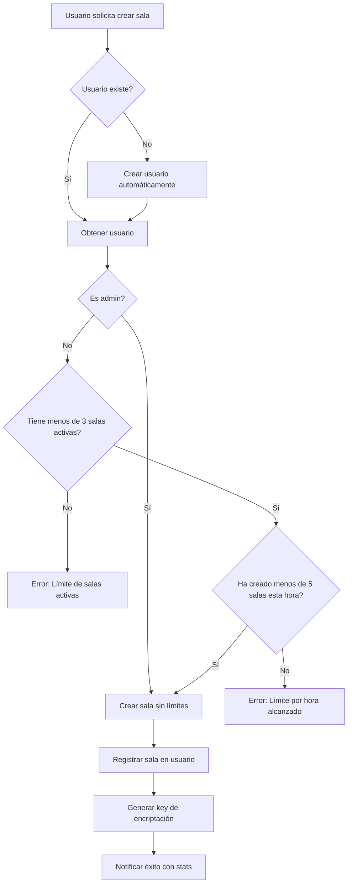

# 🎯 Sistema de Gestión de Salas y Usuarios

## 📋 Descripción General

Este sistema implementa un control completo de creación de salas con límites por usuario para prevenir saturación del servicio, junto con roles de administrador para usuarios privilegiados.

## 👥 Roles de Usuario

### 1. Usuario Regular (`user`)
- **Límites de creación de salas:**
  - ✅ Máximo **3 salas activas** simultáneamente
  - ✅ Máximo **5 salas por hora**
  - ✅ Debe cerrar una sala antes de crear otra si alcanza el límite

- **Permisos:**
  - Crear salas (con límites)
  - Unirse a cualquier sala
  - Cerrar sus propias salas
  - Ver sus estadísticas

### 2. Administrador (`admin`)
- **Límites de creación de salas:**
  - ✅ **Ilimitado** - Sin restricciones

- **Permisos:**
  - Crear salas ilimitadas
  - Unirse a cualquier sala
  - Cerrar cualquier sala (propias y de otros)
  - Ver estadísticas de todos los usuarios
  - Promover/degradar otros usuarios
  - Ejecutar limpieza manual del sistema

## 🔧 Configuración

### Límites Configurables
Estos valores están en `backend/models/User.js`:

```javascript
const MAX_ACTIVE_ROOMS = 3;        // Salas activas simultáneas
const MAX_ROOMS_PER_HOUR = 5;      // Salas creadas por hora
```

Puedes modificar estos valores según tus necesidades.

## 🚀 Uso del Sistema

### Para Usuarios Regulares

#### 1. Crear una Sala
Desde el frontend, usa el evento Socket.IO:

```javascript
socket.emit('createRoom', {
    name: 'Mi Sala',
    maxParticipants: 10,
    type: 'text', // o 'multimedia'
    username: 'miUsuario'
});

// Escuchar respuesta
socket.on('roomCreated', (data) => {
    console.log('Sala creada:', data);
    console.log('Salas restantes:', data.userStats.remainingRooms);
});

socket.on('roomError', (error) => {
    console.error('Error:', error.message);
    // Ejemplo: "Has alcanzado el límite de 3 salas activas"
});
```

#### 2. Cerrar una Sala
Solo el creador puede cerrar su sala:

```javascript
socket.emit('closeRoom', {
    pin: '123456',
    username: 'miUsuario'
});

socket.on('roomClosedSuccess', () => {
    console.log('Sala cerrada exitosamente');
});
```

#### 3. Ver Mis Estadísticas

```javascript
socket.emit('getUserStats', { username: 'miUsuario' });

socket.on('userStats', (stats) => {
    console.log('Rol:', stats.role);
    console.log('Salas activas:', stats.stats.activeRoomsCount);
    console.log('Total creadas:', stats.stats.totalRoomsCreated);
    console.log('Puedo crear más?:', stats.canCreateRoom);
});
```

#### 4. Ver Mis Salas Activas

```javascript
socket.emit('getMyRooms', { username: 'miUsuario' });

socket.on('myRooms', (data) => {
    console.log('Salas activas:', data.activeRooms);
    console.log('Puedo crear más?:', data.canCreateMore);
    console.log('Detalles:', data.details);
});
```

### Para Administradores

#### 1. Crear un Admin Inicial
Desde el servidor (terminal):

```bash
cd backend
npm run create-admin
```

Esto crea el admin por defecto:
- Username: `admin`
- Password: `Admin@123456`

#### 2. Promover Usuario Regular a Admin
Desde el servidor (terminal):

```bash
cd backend
npm run promote-user
# Ingresa el nombre de usuario cuando se solicite
```

O vía API (requiere estar autenticado como admin):

```bash
POST /api/users/miUsuario/promote
Authorization: Bearer <JWT_TOKEN>
```

#### 3. Degradar Admin a Usuario Regular

```bash
POST /api/users/miUsuario/demote
Authorization: Bearer <JWT_TOKEN>
```

#### 4. Ver Todos los Usuarios

```bash
GET /api/users?page=1&limit=50
Authorization: Bearer <JWT_TOKEN>
```

#### 5. Cerrar Cualquier Sala

```javascript
socket.emit('closeRoom', {
    pin: '123456',
    username: 'adminUsername'
});
```

#### 6. Limpieza Manual del Sistema

```bash
POST /api/users/cleanup
Authorization: Bearer <JWT_TOKEN>
```

Esto elimina:
- Usuarios inactivos por más de 30 días
- Referencias a salas cerradas
- Resetea contadores obsoletos

## 📊 API REST Endpoints

### Públicos

#### GET `/api/users/:username/stats`
Obtiene estadísticas de un usuario.

**Respuesta:**
```json
{
  "username": "usuario123",
  "role": "user",
  "stats": {
    "totalRoomsCreated": 15,
    "activeRoomsCount": 2,
    "lastRoomCreatedAt": "2025-10-25T10:30:00.000Z"
  },
  "activeRooms": [
    {
      "roomId": "...",
      "pin": "123456",
      "createdAt": "2025-10-25T10:00:00.000Z"
    }
  ],
  "canCreateRoom": true,
  "canCreateRoomDetails": {
    "allowed": true,
    "remainingRooms": 1,
    "remainingThisHour": 3
  }
}
```

#### GET `/api/users/:username/can-create-room`
Verifica si el usuario puede crear una sala.

**Respuesta (permitido):**
```json
{
  "allowed": true,
  "remainingRooms": 2,
  "remainingThisHour": 4
}
```

**Respuesta (límite alcanzado):**
```json
{
  "allowed": false,
  "reason": "Has alcanzado el límite de 3 salas activas. Cierra una sala antes de crear otra.",
  "currentCount": 3,
  "maxAllowed": 3
}
```

### Protegidos (Requieren Admin JWT)

#### GET `/api/users`
Lista todos los usuarios (paginado).

#### POST `/api/users/:username/promote`
Promueve usuario a admin.

#### POST `/api/users/:username/demote`
Degrada admin a usuario.

#### POST `/api/users/cleanup`
Ejecuta limpieza del sistema.

## 🎮 Eventos Socket.IO

### Emitir (Cliente → Servidor)

| Evento | Parámetros | Descripción |
|--------|-----------|-------------|
| `createRoom` | `{ name, maxParticipants, type, username }` | Crear nueva sala |
| `closeRoom` | `{ pin, username }` | Cerrar sala |
| `getUserStats` | `{ username }` | Obtener estadísticas |
| `getMyRooms` | `{ username }` | Obtener salas activas |

### Escuchar (Servidor → Cliente)

| Evento | Datos | Descripción |
|--------|-------|-------------|
| `roomCreated` | `{ ...room, autoJoin, userStats }` | Sala creada exitosamente |
| `roomError` | `{ message, details }` | Error al crear/cerrar sala |
| `roomClosed` | `{ pin, message, closedBy }` | Sala cerrada |
| `userStats` | `{ username, role, stats, ... }` | Estadísticas del usuario |
| `myRooms` | `{ activeRooms, canCreateMore, ... }` | Salas activas del usuario |

## 🔒 Seguridad y Validación

### 1. Validación de Nombre de Usuario
- Mínimo 3 caracteres
- Máximo 30 caracteres
- Se sanitiza para prevenir XSS

### 2. Tracking de Usuarios
- IP Address
- Device Fingerprint
- Última actividad

### 3. Rate Limiting
El sistema resetea automáticamente cada hora:
- Contador de salas creadas por hora
- Se mantiene el límite de salas activas

### 4. Audit Logs
Todas las acciones importantes se registran:
- Creación de salas
- Cierre de salas
- Promoción/degradación de usuarios
- JOIN/LEAVE de salas

## 🧹 Limpieza Automática

El sistema ejecuta limpieza cada hora:

1. **Salas Expiradas:**
   - Marca como inactivas
   - Actualiza contadores de usuarios

2. **Usuarios Inactivos:**
   - Sin actividad por 30+ días
   - Sin salas activas
   - Solo usuarios regulares (no admins)

3. **Sesiones:**
   - MongoDB TTL automático
   - Limpieza de sesiones expiradas

## 📝 Mensajes de Error Comunes

### "Has alcanzado el límite de X salas activas"
**Solución:** Cierra una sala existente antes de crear una nueva.

```javascript
socket.emit('closeRoom', { pin: 'PIN_DE_SALA', username: 'tuUsuario' });
```

### "Has alcanzado el límite de X salas por hora"
**Solución:** Espera hasta que se resetee el contador (se muestra tiempo restante).

### "No tienes permisos para cerrar esta sala"
**Solución:** Solo el creador de la sala o un admin pueden cerrarla.

### "Usuario no encontrado"
**Solución:** El usuario se crea automáticamente al crear su primera sala.

## 💡 Mejores Prácticas

### Para Usuarios
1. ✅ Cierra salas cuando ya no las necesites
2. ✅ Verifica tus límites antes de crear salas
3. ✅ Usa nombres descriptivos para tus salas
4. ✅ Configura el número adecuado de participantes

### Para Administradores
1. ✅ Ejecuta limpieza manual periódicamente
2. ✅ Monitorea usuarios con muchas salas activas
3. ✅ Promociona usuarios confiables a admin si es necesario
4. ✅ Revisa logs de auditoría regularmente

### Para Desarrolladores
1. ✅ Ajusta límites según capacidad del servidor
2. ✅ Monitorea uso de MongoDB
3. ✅ Implementa alertas para uso excesivo
4. ✅ Considera rate limiting en API REST también

## 🔄 Flujo de Creación de Sala



## 📞 Soporte

Para problemas o preguntas:
1. Revisa los logs del servidor
2. Verifica estadísticas del usuario
3. Consulta logs de auditoría
4. Ejecuta limpieza manual si es necesario

---

**Nota:** Este sistema está diseñado para prevenir abuso y saturación del servicio mientras proporciona flexibilidad a administradores de confianza.
